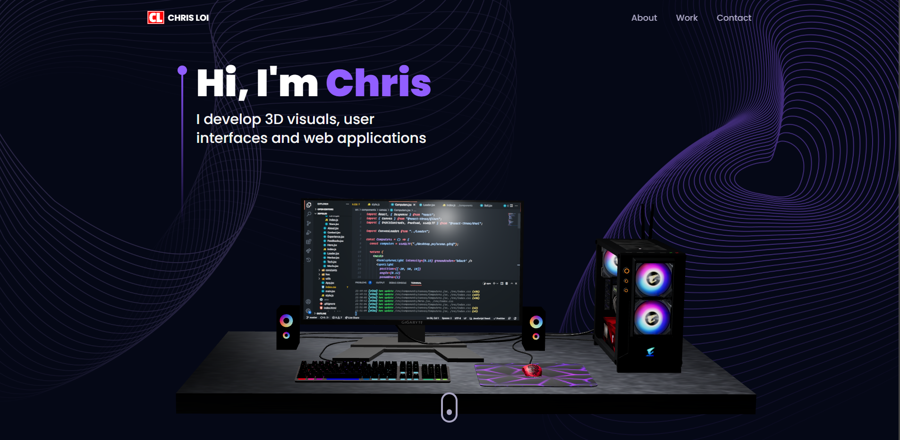

<!--- Typing animated text SVG generator https://readme-typing-svg.herokuapp.com --->

<!---

--->

<!--- header image --->

 

  

<!--- portfolio launch image --->

<a href="https://christopherloi.github.io/">

  

</a>

<!--- social media icons, you can find them in assets directory of this repo --->

  
  
  
  

<!--- a bit of vertical space & languages text --->

&nbsp;

  

  
  
<!--- language icons --->
  

  
  
<!-- &nbsp;
<h1 align="center">
  ABOUT ME
</h1> -->
  
<!--  -->

  <!--- Personal --->

  <!--- Education --->

  <!--- Portfolio/Website --->

<h1 align="center">
    Portfolio/Website
    </h2>
  
  `Personal Website` -> <a href="https://christopherloi.github.io/" target="_blank">`Christopher Loi`</a>
  
  `Linktree` -> <a href="https://linktr.ee/zebroe" target="_blank">`Christopher Loi`</a>
  
  
  <!--- Buy Me a Coffee ☕ ---> 
  
<h3 align="center"></h3>

  <!--- adding 3D earth icon to show some love for the environment 🌏 --->

<!-- collapsed details of github stats and activity -->

 
  
<h2>📊 Github Stats and Activity</h2>

  <h3>🔥 Streak Stats</h3>

  <!-- GitHub Readme Streak Stats - https://github.com/DenverCoder1/github-readme-streak-stats -->
  

    
    
🔥 Get streak stats for your profile at <a href="https://git.io/streak-stats">git.io/streak-stats</a>

  

  <h3>💻 GitHub Profile Stats</h3>

  <!-- https://github.com/anuraghazra/github-readme-stats -->

 

<b>Note:</b> Top languages is only a metric of the languages my public code consists of and doesn't reflect experience or skill level.

  <!-- https://github.com/ashutosh00710/github-readme-activity-graph -->

  <h3>⚡ Recent GitHub Activity</h3>

  <!-- https://github.com/jamesgeorge007/github-activity-readme -->
  <!--START_SECTION:activity-->

1. 🎉 Merged PR [#834](https://github.com/DenverCoder1/custom-icon-badges/pull/834) in [DenverCoder1/custom-icon-badges](https://github.com/DenverCoder1/custom-icon-badges)
2. 🎉 Merged PR [#835](https://github.com/DenverCoder1/custom-icon-badges/pull/835) in [DenverCoder1/custom-icon-badges](https://github.com/DenverCoder1/custom-icon-badges)
3. 🎉 Merged PR [#530](https://github.com/DenverCoder1/github-readme-streak-stats/pull/530) in [DenverCoder1/github-readme-streak-stats](https://github.com/DenverCoder1/github-readme-streak-stats)
4. ❗️ Reopened issue [#236](https://github.com/DenverCoder1/github-readme-streak-stats/issues/236) in [DenverCoder1/github-readme-streak-stats](https://github.com/DenverCoder1/github-readme-streak-stats)
5. 🎉 Merged PR [#528](https://github.com/DenverCoder1/github-readme-streak-stats/pull/528) in [DenverCoder1/github-readme-streak-stats](https://github.com/DenverCoder1/github-readme-streak-stats)
<!--END_SECTION:activity-->

